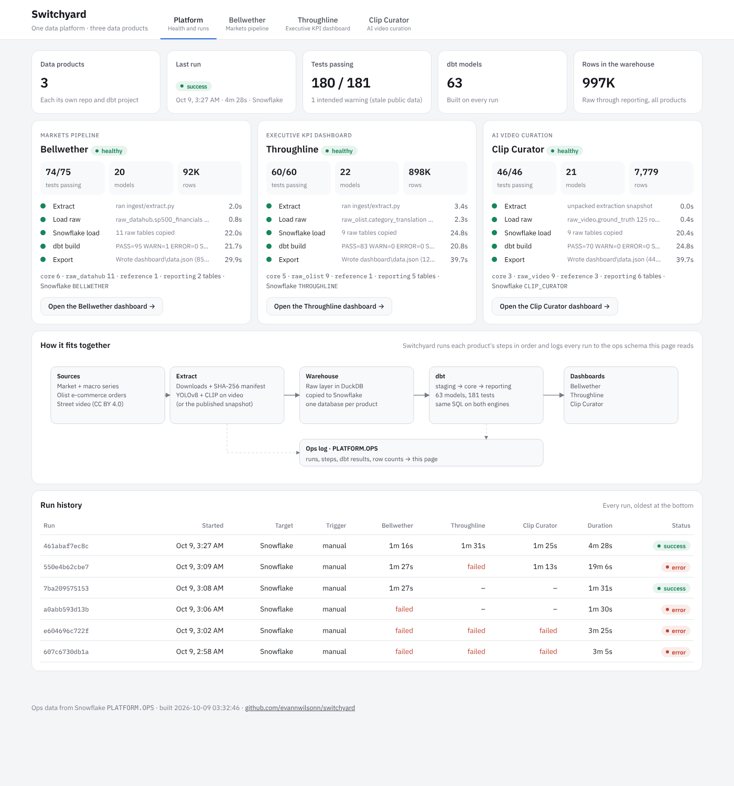

# Switchyard

Switchyard is one small data platform that runs three separate data products end to end, records what happened on every run, and serves a single app with a platform-health view plus each product's dashboard.

| Product | What it is | Repo |
|---|---|---|
| Bellwether | Markets pipeline: S&P 500, sector and macro series into monthly returns, drawdowns and real returns | [bellwether](https://github.com/evannwilsonn/bellwether) |
| Throughline | Executive KPI dashboard on ~100K Olist e-commerce orders, with a governed KPI catalog and targets | [throughline](https://github.com/evannwilsonn/throughline) |
| Clip Curator | AI video curation: YOLOv8 + CLIP extraction, rule-based accept/reject, accuracy gates in dbt | [clip-curator](https://github.com/evannwilsonn/clip-curator) |

Each product stays its own repo and dbt project. Switchyard doesn't copy their code; it clones them, runs them in order, and owns the operational layer around them.



## What a run does

For every project in `projects.yml`, `switchyard/run.py` runs five steps and stops that product at the first failure:

1. **extract** – the product's own extract scripts (Clip Curator unpacks its published AI extraction snapshot unless `--full-ai` is passed, so a run doesn't need the models).
2. **load** – raw files into the product's local DuckDB landing zone.
3. **warehouse_load** – raw tables copied into the product's Snowflake database (Parquet → stage → `COPY`, row counts checked against DuckDB).
4. **transform** – `dbt build`, every model and test, on Snowflake or DuckDB.
5. **export** – on Snowflake, the modeled layers are pulled back (`switchyard/mirror.py`) so the dashboard file is written from what Snowflake built, then the product's `export_data.py` runs.

Every run, step, dbt result and table row count goes to an ops schema: `PLATFORM.OPS` in Snowflake, or `warehouse/platform.duckdb` locally. The platform view reads only that log.

## Latest Snowflake run

Run `461abaf7ec8c`, Oct 9 2026, 4m 28s, all three products successful:

| Product | dbt | Tests | Rows in warehouse |
|---|---|---|---|
| Bellwether | 20 models | 74 pass, 1 warn (stale public macro series, intended) | 92K |
| Throughline | 22 models | 60 pass | 898K |
| Clip Curator | 21 models | 46 pass | 7.8K |

The run history in the app keeps the failed runs from getting the Snowflake export working (timestamp precision and NUMBER types coming back through Parquet); those fixes are in `mirror.py`.

## Running it

```
pip install -r requirements.txt
python -m switchyard.run                       # all products on DuckDB, no credentials
python -m app.build_app && make serve          # app at http://localhost:8000
```

On Snowflake (key-pair auth, no password is read or stored):

```
export SNOWFLAKE_ACCOUNT=... SNOWFLAKE_USER=... SNOWFLAKE_PRIVATE_KEY_PATH=~/.snowflake/rsa_key.p8
python -m switchyard.run --target snowflake
python -m app.build_app --target snowflake --save-ops app/ops_snapshot.json
```

`--only <name>` runs one product. `app/ops_snapshot.json` is the ops payload from the latest Snowflake run, so `python -m app.build_app --from-ops app/ops_snapshot.json` rebuilds the app without credentials (after a local run has produced the dashboards).

## Schedule

`.github/workflows/weekly.yml` runs everything against Snowflake on Monday mornings and uploads the built app as a workflow artifact. It needs three repository secrets: `SNOWFLAKE_ACCOUNT`, `SNOWFLAKE_USER`, and `SNOWFLAKE_PRIVATE_KEY` (the contents of the `.p8` file).

## Layout

```
projects.yml          the products, their repos, databases and steps
switchyard/run.py     orchestrator
switchyard/ops.py     ops log (Snowflake or DuckDB)
switchyard/mirror.py  Snowflake modeled layers → local DuckDB for export
app/index.html        platform view shell
app/build_app.py      builds app/build/ (static, every dashboard inlined)
```
